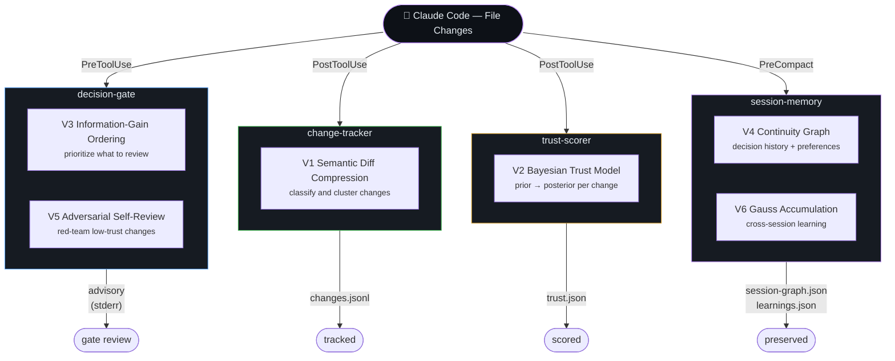
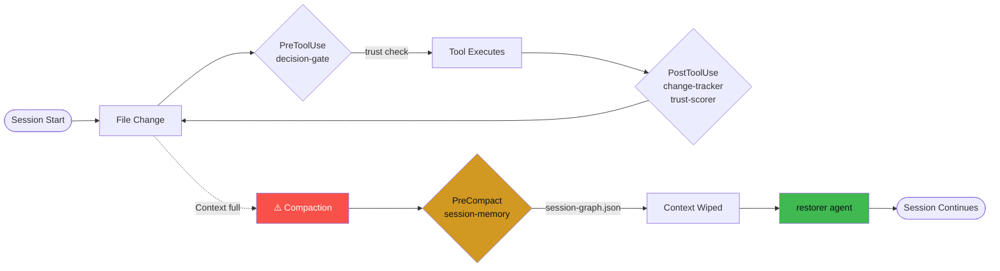

# Hornet

<p>
  <a href="LICENSE"></a>
  
  
  
  
</p>

> An @enchanted-plugins product — algorithm-driven, agent-managed, self-learning.

Real-time change comprehension. Bayesian trust scoring. Information-gain review.

**4 plugins. 6 algorithms. 4 agents. Every change accounted for.**

> Claude changed 12 files in 8 turns. I didn't read a single diff. Hornet told me
> the auth migration was safe (trust: 0.82), the config change was not (trust: 0.31),
> and the test deletions were adversarial (trust: 0.18). I reviewed 2 files instead of 12.

## Contents

- [The Problem](#the-problem)
- [How It Works](#how-it-works)
- [The Science Behind Hornet](#the-science-behind-hornet)
- [Install](#install)
- [4 Plugins, 4 Agents, 6 Algorithms](#4-plugins-4-agents-6-algorithms)
- [What You Get Per Session](#what-you-get-per-session)
- [Commands](#commands)
- [How Trust Scoring Works](#how-trust-scoring-works)
- [How Information-Gain Ordering Works](#how-information-gain-ordering-works)
- [vs Everything Else](#vs-everything-else)
- [Architecture](#architecture)
- [Contributing](#contributing)
- [License](#license)

## The Problem

The review-and-comprehension loop eats 40-60% of every Claude Code session:
- Developers rubber-stamp 93% of permission prompts (Anthropic data)
- Developers start second Claude instances to review the first (Issue #1144)
- The diff UI shows +7,490/-6,880 for an 11-line change (Issue #18541)
- No per-hunk accept/discard exists (Issue #31395)
- 10-20% of sessions are abandoned due to unexpected changes

## How It Works

Four plugins, one concern each, bound to specific hook points. **decision-gate** on `PreToolUse` orders pending reviews by information gain (V3) and red-teams low-trust changes (V5). **change-tracker** on `PostToolUse` classifies and clusters every diff (V1). **trust-scorer** on `PostToolUse` updates a Beta-Bernoulli posterior per file (V2). **session-memory** on `PreCompact` builds a continuity graph and persists cross-session learnings (V4, V6). The diagram below shows the bindings and state outputs.



Each plugin owns one concern. No overlap. No dependencies between plugins.

### Session Lifecycle

Every file change passes the `PreToolUse` gate (decision-gate), the tool executes, then `PostToolUse` updates change-tracker and trust-scorer. When context fills, `PreCompact` triggers session-memory to write `session-graph.json` before the wipe. On resume, the restorer agent reads it back autonomously.



## The Science Behind Hornet

Six named algorithms power every decision:

### V1. Semantic Diff Compression (Change Tracker)

Raw diffs are noise. Hornet classifies each change by type and clusters related changes across files.

Change types: `source_code`, `config_change`, `test_change`, `documentation`, `schema_change`, `dependency_change`.
Impact radius: local (1 file), module (2-5 files), systemic (6+ files).

$$
\text{classify}(f) = \begin{cases}
\text{config} & f \in \lbrace\texttt{.json},\texttt{.yaml},\texttt{.env}\rbrace \\
\text{test} & f \in \lbrace\texttt{test},\texttt{spec}\rbrace \\
\text{schema} & f \in \lbrace\texttt{.sql},\texttt{migration}\rbrace \\
\text{source} & \text{otherwise}
\end{cases}
$$

### V2. Bayesian Trust Scoring (Trust Scorer)

Each file change gets a trust score using Beta-Bernoulli conjugate priors.

$$P(\theta | D) = \frac{P(D | \theta) \cdot P(\theta)}{P(D)}, \quad P(\theta) = \text{Beta}(\alpha, \beta)$$

Prior: $\text{Beta}(2, 2)$ — mildly uncertain.
Update: $\alpha_{new} = \alpha + \ell$, $\beta_{new} = \beta + (1 - \ell)$, where $\ell$ is the change-type likelihood.
Trust: $\frac{\alpha}{\alpha + \beta}$ (posterior mean).

| Change Type | Likelihood $\ell$ |
|-------------|------------------|
| Documentation | 0.95 |
| Test changes | 0.85 |
| Source code (small) | 0.70 |
| Source code (large) | 0.50 |
| Schema changes | 0.55 |
| Dependencies | 0.50 |
| Config (sensitive) | 0.30 |

### V3. Information-Gain Decision Support (Decision Gate)

Help the developer review efficiently by showing the most uncertain changes first.

$$IG(X) = H(X) = -p \log_2 p - (1-p) \log_2 (1-p)$$

Maximum at $p = 0.5$ (trust is most uncertain). Changes at trust 0.5 get reviewed first.
Changes at trust 0.1 or 0.9 are already decided — low review value.

### V4. Session Continuity Graph (Session Memory)

Before compaction, build a semantic graph:
- Nodes: files (with type, trust, change count), decisions (review advisories)
- Edges: cluster relationships, file-to-decision links

On resumption: "Last session: 15 changes, 2 low-trust files flagged, 3 advisories issued."

### V5. Adversarial Self-Review (Decision Gate extension)

For low-trust changes ($\text{trust} < 0.4$), generate specific adversarial questions:
- "This changes the database query from parameterized to string interpolation. SQL injection risk."
- "This test now asserts `true === true`. The original checked actual business logic."
- "This deletes the rate limiter. Was rate limiting intentional?"

Not generic warnings. Specific to the diff content.

### V6. Gauss Learning (Cross-Session)

Exponential moving average over per-type trust rates across sessions.

$$r_{new} = \alpha \cdot s_{current} + (1 - \alpha) \cdot r_{prior}, \quad \alpha = 0.3$$

After N sessions, Hornet knows: config changes always get flagged, test changes are usually safe,
this developer always reviews schema changes carefully. Adapts priors accordingly.

## Install

Hornet ships as 4 plugins that feed each other (change-tracker → trust-scorer → decision-gate → session-memory). One meta-plugin — `full` — lists all four as dependencies, so a single install pulls in the whole chain.

**In Claude Code** (recommended):

```
/plugin marketplace add enchanted-plugins/hornet
/plugin install full@hornet
```

Claude Code resolves the dependency list and installs all 4 plugins. Verify with `/plugin list`.

**Want to cherry-pick?** Individual plugins are still installable by name — e.g. `/plugin install hornet-trust-scorer@hornet` if you only need scoring. The pipeline is designed to work end-to-end, though, so `full@hornet` is the path we recommend.

**Via shell** (also installs `shared/*.sh` and `shared/scripts/*.py` locally so hooks work offline):

```bash
bash <(curl -s https://raw.githubusercontent.com/enchanted-plugins/hornet/main/install.sh)
```

## 4 Plugins, 4 Agents, 6 Algorithms

| Plugin | Hook | Command | What |
|--------|------|---------|------|
| change-tracker | PostToolUse | `/hornet:changes` | Semantic diff compression + classification |
| trust-scorer | PostToolUse | `/hornet:trust` | Bayesian trust scoring + alerts |
| decision-gate | PreToolUse | `/hornet:review` | IG-ordered review + adversarial questions |
| session-memory | PreCompact | `/hornet:session` | Continuity graph + Gauss learning |

| Agent | Model | Plugin | What |
|-------|-------|--------|------|
| classifier | Haiku | change-tracker | Deep semantic change classification |
| auditor | Haiku | trust-scorer | Trust distribution analysis + risk report |
| adversary | Sonnet | decision-gate | Targeted adversarial review questions |
| restorer | Haiku | session-memory | Autonomous context restoration |

## What You Get Per Session

```
change-tracker/state/
├── changes.jsonl        # Every file change with type, hash, cluster
└── metrics.jsonl        # change_tracked events

trust-scorer/state/
├── trust.json           # Per-file Beta parameters and trust scores
├── learnings.json       # Cross-session Gauss learning data
└── metrics.jsonl        # trust_scored events

decision-gate/state/
└── metrics.jsonl        # review_advisory events

session-memory/state/
├── session-graph.json   # Continuity graph (nodes, edges, trust overview)
├── session-summary.md   # Human-readable session recap
└── metrics.jsonl        # session_saved events
```

## Commands

| Command | Plugin | What |
|---------|--------|------|
| `/hornet:changes` | change-tracker | All changes grouped by type and file |
| `/hornet:trust` | trust-scorer | Trust scores sorted riskiest-first |
| `/hornet:review` | decision-gate | IG-ranked review queue with adversarial questions |
| `/hornet:session` | session-memory | Full session dashboard |

## How Trust Scoring Works

1. Every file starts at $\text{Beta}(2, 2)$ — a mildly uncertain prior (mean = 0.5).
2. Each Write/Edit updates the posterior: high-trust types (docs, tests) push the score up, risky types (config, schema) push it down.
3. After multiple updates, the posterior narrows — confidence increases.
4. Reverts are penalized: if a file returns to a previous hash, the likelihood is halved.
5. Trust scores persist across the session via `trust.json`. Cross-session learning via `learnings.json`.

## How Information-Gain Ordering Works

Not all files are equally worth reviewing. Hornet ranks by uncertainty:
- Trust 0.5 → IG 1.0 (maximum uncertainty — you need to look at this)
- Trust 0.1 → IG 0.47 (clearly bad — you already know)
- Trust 0.9 → IG 0.47 (clearly good — don't waste time)

Review the uncertain files first. Skip the ones where trust is already decided.

## vs Everything Else

| | Hornet | Gryph | Context Mode | ClaudeWatch | Anthropic Review |
|---|---|---|---|---|---|
| Real-time awareness | in-session | post-hoc | — | — | post-PR |
| Trust scoring | Bayesian | — | — | — | — |
| Per-change review | IG-ordered | — | — | — | — |
| Adversarial questions | specific | — | — | — | generic |
| Session continuity | graph + learnings | — | — | — | — |
| Cross-session learning | Gauss EMA | — | — | — | — |
| Dependencies | bash + jq | Node | Node + MCP | Python | API |

## Architecture

Interactive architecture explorer with plugin diagrams, agent cards, and data flow:

**[docs/architecture/](docs/architecture/)** — auto-generated from the codebase. Run `python docs/architecture/generate.py` to regenerate.

## Contributing

See [CONTRIBUTING.md](CONTRIBUTING.md)

## License

MIT
